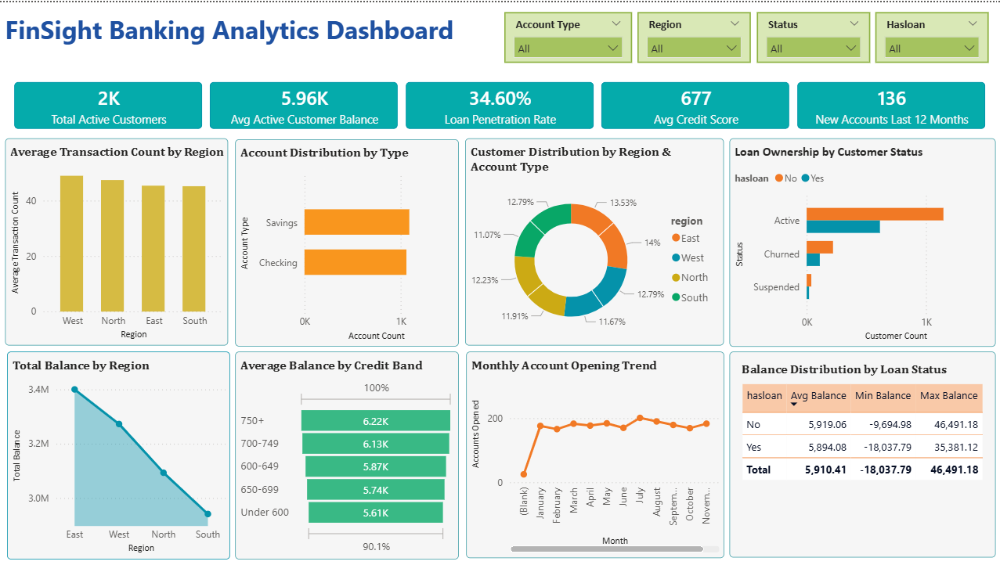

# 🏦 FinSight Banking Analytics

> **An end-to-end banking analytics solution built with PostgreSQL, Python, Power BI, and AI-assisted tooling — delivering insights into customer behavior, loan trends, and regional financial performance.**

---


## 🔍 Project Overview

**FinSight Banking Analytics** is a full-stack data analytics project built on a simulated banking dataset of 2,150 customers. It covers the complete analytics pipeline — from raw data preprocessing to SQL-based analysis and an interactive Power BI dashboard — with AI tools integrated at each stage to accelerate development and improve accuracy.

The project was developed with a focus on practical, real-world workflows where AI assistants are used as professional productivity tools, not replacements for analytical thinking. Each AI tool was selected based on its fit for the specific environment and task.

## 📸 Dashboard Screenshots



---

**Key areas of analysis:**
- 📊 Customer segmentation by status, region, and account type
- 💳 Loan penetration and ownership patterns
- 📈 Monthly account opening trends over time
- 💰 Balance distribution across credit score bands
- 🗺️ Regional financial performance comparison

**Pipeline summary:** Raw data → Python (Pandas) cleaning → PostgreSQL SQL analysis → Power BI DAX measures → Interactive dashboard

---

## 🤖 AI Tools Used

AI tools were integrated at each stage of this project as part of a deliberate, professional workflow — used to increase development speed, reduce errors, and handle repetitive tasks, while all analytical decisions remained human-driven.

### 🐍 Stage 1 — Data Cleaning with Pandas + GitHub Copilot
- **GitHub Copilot** was used inside VS Code while writing **Pandas** data cleaning scripts
- Copilot assisted with auto-completing transformation logic, handling null values, correcting data types, and structuring the preprocessing pipeline
- Reduced manual effort on repetitive wrangling tasks, allowing focus on data quality validation

### 🗄️ Stage 2 — SQL Analysis with GitHub Copilot
- All **13 analytical SQL queries** were developed in **PostgreSQL** with Copilot assistance
- Copilot provided suggestions for query structure, aggregation logic, CASE expressions, and GROUP BY patterns based on inline comments
- Queries were reviewed and validated manually before use to ensure correctness

### 📊 Stage 3 — DAX Measures with Claude AI
- All 13 SQL queries were re-implemented as **DAX measures** inside Power BI Desktop
- **GitHub Copilot is not natively available in Power BI Desktop**, so **Claude AI (by Anthropic)** was used for DAX conversion and debugging
- Claude assisted with resolving table name conflicts, column case sensitivity issues, and DAX syntax differences from SQL
- This reflects a practical, real-world approach: selecting the right AI tool based on the environment and its constraints

### 💡 Approach
> AI tools in this project were used as professional productivity instruments — each chosen based on environment compatibility and task type. The analytical logic, business questions, and final review at every stage were handled independently.

---

## 🛠️ Tech Stack

| Tool | Purpose |
|---|---|
| **Python (Pandas)** | Data cleaning & preprocessing |
| **PostgreSQL** | Data storage & SQL analysis |
| **GitHub Copilot** | AI assistant for Pandas & SQL |
| **Power BI Desktop** | Dashboard & visualization |
| **DAX** | Data Analysis Expressions for measures |
| **Power Query (M)** | Data transformation inside Power BI |
| **Claude AI** | AI assistant for DAX measure writing |
| **GitHub** | Version control & project sharing |

---

## 📂 Dataset

**Table Name:** `banking_data`
**Total Rows:** 2,150 customers
**Source:** Simulated banking customer dataset

### Column Reference

| Column | Data Type | Description |
|---|---|---|
| `customerid` | TEXT | Unique customer identifier |
| `age` | INTEGER | Customer age |
| `accounttype` | TEXT | Savings / Current / Fixed |
| `balance` | FLOAT | Account balance (USD) |
| `opendate` | DATE | Account opening date |
| `status` | TEXT | Active / Inactive |
| `creditscore` | INTEGER | Credit score (300–850) |
| `region` | TEXT | East / West / North / South |
| `transactioncount` | INTEGER | Total number of transactions |
| `hasloan` | TEXT | Yes / No |

---

## 🧮 DAX Measures

> All DAX measures below were converted from the original SQL queries with the help of **Claude AI**.
> The full SQL query file is available in `sql/banking_queries.sql`.

### KPI Measures (Cards)

```dax
-- 1. Total Active Customers
Total Active Customers = 
CALCULATE(
    COUNTROWS(banking_data),
    banking_data[status] = "Active"
)

-- 2. Average Active Customer Balance
Average Active Customer Balance = 
CALCULATE(
    ROUND(AVERAGE(banking_data[balance]), 0),
    banking_data[status] = "Active"
)

-- 3. Loan Penetration Rate %
Loan Penetration Rate % = 
DIVIDE(
    CALCULATE(
        COUNTROWS(banking_data),
        banking_data[hasloan] = "Yes"
    ),
    COUNTROWS(banking_data)
)
-- Format as % in Measure Tools → Format → Percentage

-- 4. Average Credit Score
Average Credit Score = 
ROUND(AVERAGE(banking_data[creditscore]), 0)

-- 5. New Accounts Last 12 Months
New Accounts Last 12 Months = 
CALCULATE(
    COUNTROWS(banking_data),
    banking_data[opendate] >= EDATE(TODAY(), -12)
)
```

### Chart Measures

```dax
-- 6. Account Count
Account Count = COUNTROWS(banking_data)

-- 7. Total Balance
Total Balance = 
ROUND(SUM(banking_data[balance]), 2)

-- 8. Count Customers
Count Customers = COUNTROWS(banking_data)

-- 9. Accounts Opened
Accounts Opened = COUNTROWS(banking_data)

-- 10a. CreditScore Band (Calculated COLUMN — not a measure)
CreditScore Band = 
SWITCH(
    TRUE(),
    banking_data[creditscore] < 600,  "Under 600",
    banking_data[creditscore] <= 649, "600-649",
    banking_data[creditscore] <= 699, "650-699",
    banking_data[creditscore] <= 749, "700-749",
    "750+"
)

-- 10b. Average Balance by Credit Band
Average Balance by Credit Band = 
ROUND(AVERAGE(banking_data[balance]), 2)

-- 11. Average Transaction Count
Average Transaction Count = 
ROUND(AVERAGE(banking_data[transactioncount]), 2)

-- 12. Customer Count
Customer Count = COUNTROWS(banking_data)

-- 13a. Avg Balance by Loan Status
Avg Balance by Loan Status = 
ROUND(AVERAGE(banking_data[balance]), 2)

-- 13b. Min Balance by Loan Status
Min Balance by Loan Status = 
MIN(banking_data[balance])

-- 13c. Max Balance by Loan Status
Max Balance by Loan Status = 
MAX(banking_data[balance])
```

> ⚠️ **Note:** `CreditScore Band` must be created as a **Calculated Column** (New Column), NOT a measure.

---

## 🗂️ Project Structure

```
FinSight_Banking/
|
├── 📁 data/
|   ├──banking_raw data  
│   └── cleaned_banking_data.csv     
|
├── 📁 notebook/
│   └── data_cleaning.py             # Pandas data cleaning script (written with GitHub Copilot)
|
├── 📁 sql/
|   ├── schema.sql
│   └── all_queries.sql              # All 13 SQL queries (written with GitHub Copilot)
│
│
├── 📁 doc/
│   └── finsight_banking.png          # powerbi dashboard
│
└── README.md                        # Project documentation
```

---

## 🚀 How to Use

### Step 1: Clone the Repository
```bash
git clone https://github.com/your-username/finsight-banking-analytics.git
cd finsight-banking-analytics
```

### Step 2: Run Data Cleaning Script
- Make sure Python and Pandas are installed
- Run the cleaning script:
```bash
pip install pandas
python python/data_cleaning.py
```

### Step 3: Run sql files
- Connect **PostgreSQL**
- Run `schema.sql` to create the database and tables.
- Run `all_queries.sql` to get the 13 queries and their outputs. 

### Step 4: Connect Your Data Source
- Go to **Home → Transform Data → Data Source Settings**
- Update the PostgreSQL connection to your local server:
  - Server: `localhost`
  - Database: `finsight_banking`
  - Table: `banking_data`
- Click **Refresh**

### Step 5: Verify DAX Measures
- Open the **Fields pane** on the right
- Confirm all measures are listed under `banking_data`
- If any measure shows an error, re-enter it from the DAX Measures section above

### Step 6: Explore the Dashboard
- Use **slicers** to filter by Account Type, Region, Status, Hasloan
- Hover over charts for **tooltips**
- Click any bar/segment to **cross-filter** other visuals


---

## 👤 Author

**Bithi Nath**
🔗 [Bithi Nath](https://linkedin.com/in/bithinath)
🐙 [@bithiNath](https://github.com/bithiNath)

---

## 📄 License

This project is licensed under the **MIT License** — feel free to use, modify, and distribute.

---

## ⭐ Support

If you found this project helpful, please give it a **⭐ star** on GitHub!
Pull requests and feedback are always welcome. 🙌

---

*Built with ❤️ using Python + PostgreSQL + Power BI + AI Tools*
